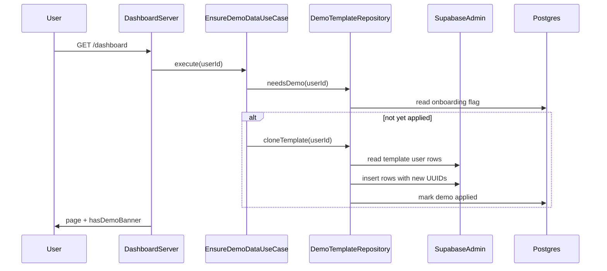

# Plano: base de demonstração na criação de conta

## Contexto no código hoje

- O conjunto de atletas, avaliações e a geração de análises via Anthropic já existe em `[app/api/seed/route.ts](app/api/seed/route.ts)` (`ATHLETES`, insert em `students` / `assessments` / `ai_analyses`). Hoje a rota é **só desenvolvimento** e **rechama a API** a cada seed — não serve como modelo final para produção.
- O pós-login padrão é `[/dashboard](app/dashboard/page.tsx)` (callback em `[app/auth/callback/route.ts](app/auth/callback/route.ts)`).
- RLS exige `user_id` = `auth.uid()` em `students`, `assessments`, `ai_analyses` (`[SCHEMA.sql](SCHEMA.sql)`).

## Decisão de produto (confirmada)

- **Disparo**: na **primeira visita autenticada** ao app (p.ex. ao carregar o dashboard), com lógica **idempotente** (não duplicar se já aplicado).

## Arquitetura proposta

1. **Fonte canônica do template (uma vez só)**
  - Manter um **usuário template** no Supabase (conta interna), cujo `user_id` fica em variável de ambiente `**DEMO_TEMPLATE_USER_ID`** (ou nome equivalente).  
  - Popular esse usuário **uma vez** (staging/prod) usando o fluxo atual de seed ou script administrativo, até todas as linhas de `ai_analyses` estarem `status = 'done'`.  
  - **Clonar** desse usuário para o `user_id` do novo trainer: novos UUIDs para `students`, `assessments`, `ai_analyses`; **mapa** `assessment_id_antigo → novo` para preencher `last_assessment_id` nas análises copiadas.  
  - Não reprocessar IA na cópia — apenas `INSERT` com o `content` já salvo.
2. **Marcar dados de demonstração**
  - Migração em `[SCHEMA.sql](SCHEMA.sql)`: coluna `is_demo boolean NOT NULL DEFAULT false` em `public.students` (cascata já remove avaliações/análises/links ao apagar o aluno).  
  - Na clonagem, todas as linhas de alunos copiados entram com `is_demo = true`; alunos criados pelo trainer continuam `false`.
3. **Garantir idempotência e “limpei e não volta”**
  - Tabela pequena `**public.user_demo_state`** (ou nome alinhado ao domínio), por exemplo:  
   `user_id` PK → `auth.users`, `template_version int`, `applied_at timestamptz`, `cleared_at timestamptz nullable`.  
  - Regras:  
    - Se `applied_at` já preenchido → não clonar de novo.  
    - Ação “Limpar demonstração”: `DELETE FROM students WHERE user_id = $1 AND is_demo = true` + `cleared_at = now()` (e opcionalmente `applied_at` mantido para auditoria).  
    - Se no futuro subir **nova versão** do template, pode-se incrementar `template_version` global e reaplicar só se produto quiser (fora do escopo mínimo).
4. **Camadas (DDD)**
  - `domain/.../IDemoTemplateRepository.ts` — contrato: `getTemplateSnapshot()` ou operações de leitura do template + escrita para o usuário (a implementação pode ser um único método `cloneTemplateToUser(targetUserId)`).  
  - `application/.../EnsureDemoDataUseCase.ts` — orquestra: ler estado; se necessário, chamar repositório.  
  - `application/.../ClearDemoDataUseCase.ts` — remove só `is_demo` + atualiza estado.  
  - `infrastructure/supabase/DemoTemplateRepository.ts` — **somente aqui** `createAdminClient()`; leituras do usuário template e inserts com `user_id = targetUserId`.  
  - `[app/dashboard/page.tsx](app/dashboard/page.tsx)` (Server Component): após `getUser()`, instanciar use case e `await ensureDemo.execute(user.id)` **antes** das queries de lista (ou logo no início).  
  - Server Action em `app/dashboard/_actions.ts` (ou `app/settings/`) para “Limpar dados de demonstração”, chamando `ClearDemoDataUseCase`.
5. **UI: deixar claro que é demonstração**
  - Calcular `hasDemoData = students.some(s => s.is_demo)` (expor `is_demo` no select de alunos no dashboard).  
  - Banner fixo ou alert no `[DashboardClient](app/dashboard/_components/DashboardClient.tsx)` (e opcionalmente na lista de atletas com badge “Demo”) + CTA “Limpar dados de demonstração” (confirmação modal).  
  - Copy sugerida: dados fictícios para explorar o produto; limpar remove só a demo e mantém (vazio) para dados reais.
6. **Tipos e consistência**
  - Atualizar tipos gerados / `[lib/supabase/database.types.ts](lib/supabase/database.types.ts)` após migração (conforme fluxo do projeto).  
  - Inserções em `ai_analyses` devem incluir colunas já usadas no app (`status`, e se aplicável `duration_ms` / tokens como `null` na cópia).
7. **Segurança e operações**
  - Rota atual de seed continua **dev-only**; a clonagem em prod usa **service role só no servidor**, nunca no cliente.  
  - Validar que `DEMO_TEMPLATE_USER_ID` ≠ usuário atual antes de clonar (defesa em profundidade).  
  - Documentar no README interno ou comentário de deploy: criar usuário template, rodar seed uma vez, definir env.

## O que não entra no MVP (pode vir depois)

- Reaplicar automaticamente nova versão do template para quem já limpou.  
- Opt-out na tela de registro (“Começar sem dados de demo”).  
- Clonar `metric_configs` / `trainer_profiles` do template (hoje o seed não popula isso; onboarding do dashboard já trata perfil vazio).

## Riscos / mitigação

- **Primeira carga do dashboard** um pouco mais lenta na primeira vez: mitigar com transação curta e índices existentes; opcional loading skeleton se necessário.  
- **Template user exposto**: tratar como segredo operacional; ID só no servidor.

